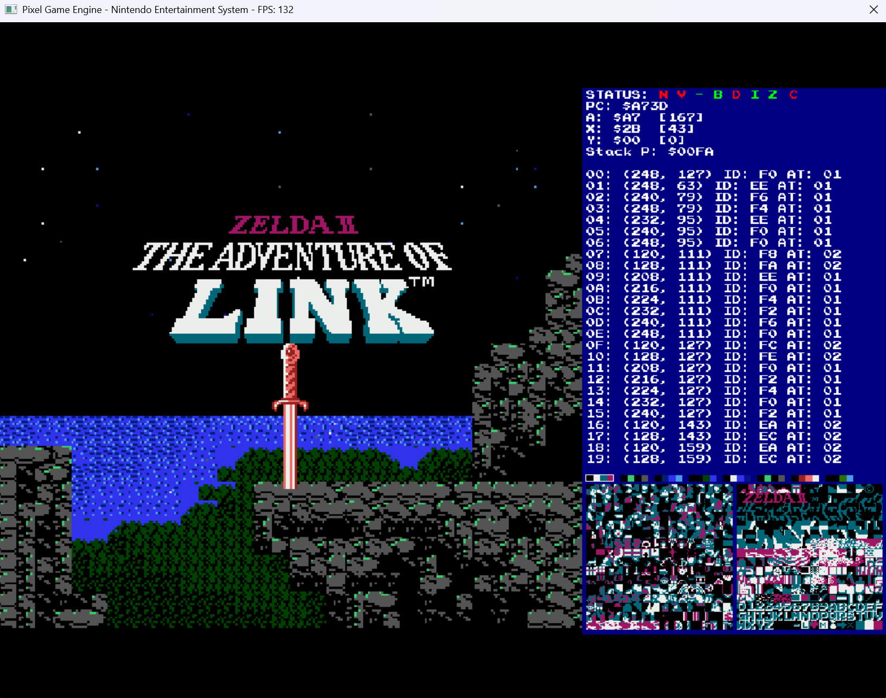
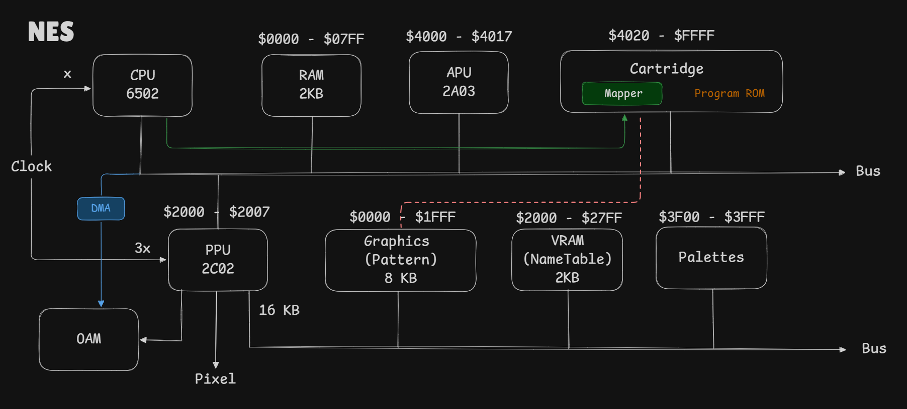

# 👾 NES Emulator in C++


A highly accurate, hardware-level emulator for the Nintendo Entertainment System (NES), written entirely from scratch in C++17. 

This project is a deep dive into low-level system architecture, successfully simulating the MOS 6502 microprocessor, the Ricoh 2C02 Picture Processing Unit (PPU), and the complex 2A03 Audio Processing Unit (APU) with cycle-accurate synchronization.

## 📸 Showcase


*Gameplay demonstration showing accurate background scrolling, foreground sprite priority, and real-time palette rendering.*


*Watch the emulator running in real-time with cycle-accurate sprite rendering.*

---

## ✨ Core Features

* **Central Processing Unit (CPU - MOS 6502):** Fully implements all documented opcodes, addressing modes, status flags, and hardware interrupts (NMI/IRQ).
* **Picture Processing Unit (PPU - Ricoh 2C02):** Highly accurate graphics rendering including background pattern shifting, Object Attribute Memory (OAM), sprite evaluation, DMA transfers, and scrolling.
* **Audio Processing Unit (APU - Ricoh 2A03):** Implements Pulse, Triangle, and Noise channels using a zero-cost abstraction lambda sequencer and an authentic hardware resistor mixer formula for anti-aliased audio.
* **Memory Management & Mappers:** Abstracted base class architecture supporting multiple cartridge hardware variations. Fully playable support for:
  * Mapper 000 (NROM)
  * Mapper 001 (MMC1)
  * Mapper 002 (UxROM)
  * Mapper 003 (CNROM)
  * Mapper 004 (MMC3 - with scanline IRQ counting)
  * Mapper 066 (GxROM)

---

## 🛠️ Building from Source

### Prerequisites
* **Compiler:** MinGW-w64 (GCC) with C++17 support.
* **OS:** Windows (uses standard Win32 APIs for the underlying graphics/audio engine).

### Compilation
Clone the repository and run the following command in your terminal from the root directory. This uses a static build to bundle dependencies directly into the executable.

```bash
g++ -std=c++17 -I include -I third_party source/*.cpp frontend/main.cpp -o build/emulator.exe -luser32 -lgdi32 -lopengl32 -lgdiplus -lShlwapi -ldwmapi -lwinmm -lstdc++fs -static
```

### Running the Emulator
To run a game, ensure your legally dumped .nes ROM file is in the same directory (or update the file path in frontend/main.cpp), then execute:

```bash
.\build\emulator.exe
```

## 🎮 Controls

The emulator uses the PC keyboard mapped to the original NES gamepad layout. Donkey Kong and other classic hardware safety checks (like preventing simultaneous opposing D-Pad inputs) are fully implemented.

| NES Controller | PC Keyboard |
| :--- | :--- |
| **D-Pad Up** | Up Arrow |
| **D-Pad Down** | Down Arrow |
| **D-Pad Left** | Left Arrow |
| **D-Pad Right** | Right Arrow |
| **A Button** | Z Key |
| **B Button** | X Key |
| **Select** | A Key |
| **Start** | S Key |

---

## 🏗️ Architecture & Technical Highlights

This emulator models the physical motherboard of the NES. The core system relies on a `Bus` object that wires the CPU, PPU, and APU together. 

The most significant technical challenge overcome during development was eliminating APU audio stuttering. By utilizing C++ templates for the audio sequencer clock instead of `std::function`, heap allocations were eliminated from the execution loop, achieving a zero-cost abstraction that completely resolved CPU bottlenecks.

This diagram illustrates the bus-based architecture used to route data between the CPU, PPU, and APU.

*Detailed hardware bus and component routing diagram.*
